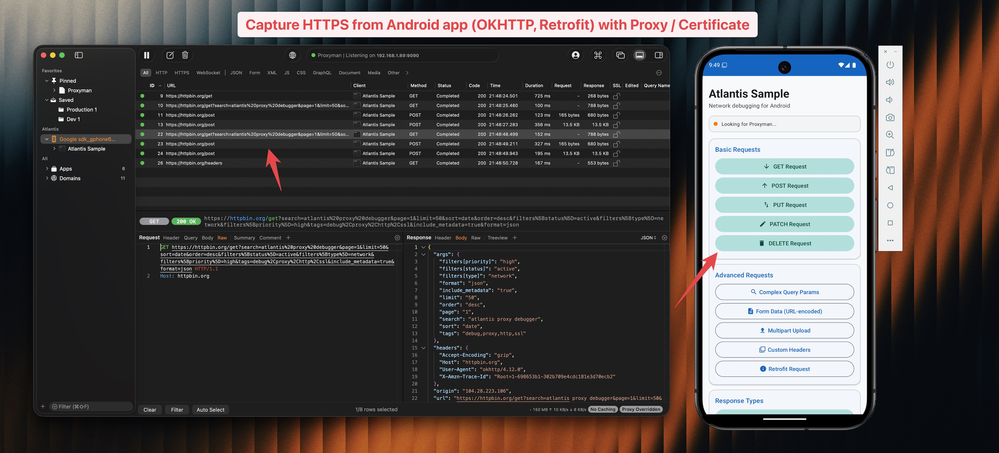

# Atlantis Android

Capture HTTP/HTTPS traffic from Android apps and send to Proxyman for debugging.

[](https://proxyman.com)

## Overview

Atlantis Android is a companion library to [Proxyman](https://proxyman.com) that allows you to capture and inspect network traffic from your Android applications without configuring a proxy or installing certificates.

## Features

- Automatic OkHttp traffic interception
- WebSocket message capture (send, receive, close)
- Works with Retrofit 2.9+ and Apollo Kotlin 3.x/4.x
- Network Service Discovery (NSD) for automatic Proxyman detection
- Direct connection support for emulators
- GZIP compression for efficient data transfer
- Minimal configuration required

## Requirements

- Android API 26+ (Android 8.0 Oreo)
- OkHttp 4.x or 5.x
- Kotlin 1.9+

## Installation

### Gradle (Kotlin DSL)

```kotlin
dependencies {
    debugImplementation("com.proxyman:atlantis-android:1.0.0")
}
```

### Gradle (Groovy)

```groovy
dependencies {
    debugImplementation 'com.proxyman:atlantis-android:1.0.0'
}
```

## Quick Start

### 1. Initialize in Application

```kotlin
class MyApplication : Application() {
    override fun onCreate() {
        super.onCreate()
        
        if (BuildConfig.DEBUG) {
            Atlantis.start(this)
        }
    }
}
```

### 2. Add Interceptor to OkHttpClient

```kotlin
val okHttpClient = OkHttpClient.Builder()
    .addInterceptor(Atlantis.getInterceptor())
    .build()
```

### 3. Capture WebSocket Traffic (Optional)

Wrap your `WebSocketListener` with `Atlantis.wrapWebSocketListener()` to capture WebSocket messages:

```kotlin
val listener = Atlantis.wrapWebSocketListener(object : WebSocketListener() {
    override fun onOpen(webSocket: WebSocket, response: Response) {
        // your logic
    }
    override fun onMessage(webSocket: WebSocket, text: String) {
        // your logic
    }
    // ...
})

okHttpClient.newWebSocket(request, listener)
```

### 4. Run Your App

Open Proxyman on your Mac, run your Android app, and watch the traffic appear!

## Project Structure

```
atlantis-android/
├── atlantis/              # Library module
│   └── src/
│       ├── main/kotlin/
│       │   └── com/proxyman/atlantis/
│       │       ├── Atlantis.kt                  # Main entry point
│       │       ├── AtlantisInterceptor.kt        # OkHttp interceptor
│       │       ├── AtlantisWebSocketListener.kt  # WebSocket capture
│       │       ├── Base64Utils.kt                # Base64 encoding
│       │       ├── Configuration.kt              # Config model
│       │       ├── GzipCompression.kt            # Compression
│       │       ├── Message.kt                    # Message types
│       │       ├── NsdServiceDiscovery.kt        # mDNS discovery
│       │       ├── Packages.kt                   # Data models
│       │       └── Transporter.kt                # TCP connection
│       └── test/kotlin/                          # Unit tests
├── sample/                # Sample app
├── PUBLISHING.md          # Publishing guide
└── README.md
```

## Setup

### Option 1: Open in Android Studio (Recommended)

Simply open the `atlantis-android` folder in Android Studio. It will automatically download the Gradle wrapper and sync the project.

### Option 2: Generate Gradle Wrapper Manually

If you have Gradle installed locally:

```bash
cd atlantis-android
gradle wrapper --gradle-version 8.7
```

## Building

```bash
# Build the library
./gradlew :atlantis:build

# Run tests
./gradlew :atlantis:test

# Build sample app
./gradlew :sample:assembleDebug
```

## Testing

```bash
./gradlew :atlantis:test
```

## Publishing

See [PUBLISHING.md](PUBLISHING.md) for instructions on publishing to Maven Central or JitPack.

## License

Apache License 2.0
